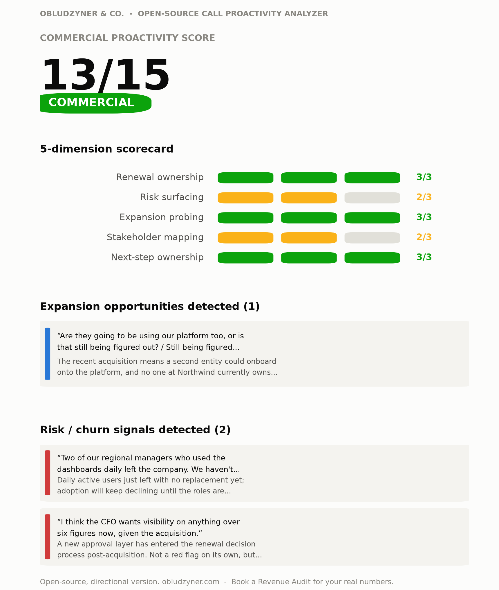

# Call Proactivity & Expansion Signal Analyzer (open-source edition)

Reads a customer call transcript and scores how commercially proactive the CSM/AM was, against a transparent 5-dimension rubric, then separately surfaces expansion opportunities and risk signals with direct quotes.

[](https://www.python.org/)
[](score.py)
[](LICENSE)
[](https://github.com/marianoobludzyner-hub)

**Jump to:** [What you get](#what-you-get) | [Who this is for](#who-this-is-for) | [Why this project](#why-this-project) | [Results](#results) | [How to run it](#how-to-run-it) | [Method](#method) | [How this connects to Obludzyner and Co.](#how-this-connects-to-obludzyner-and-co)

Part of the same open-source series as [nrr-leak-diagnostic](https://github.com/marianoobludzyner-hub/nrr-leak-diagnostic) (company-level leak estimate), [renewal-risk-rollup](https://github.com/marianoobludzyner-hub/renewal-risk-rollup) (account-level ARR at risk), [account-x-ray](https://github.com/marianoobludzyner-hub/account-x-ray) (single-account radiography), and [mariano-mentor](https://github.com/marianoobludzyner-hub/mariano-mentor) (installable advisor), by [Mariano Obludzyner](https://github.com/marianoobludzyner-hub), founder of Obludzyner & Co. This one is the "T" piece: AI automation applied to a single call instead of a spreadsheet.

<p align="center">
  
</p>

<p align="center"><sub>Real output scored against <a href="examples/sample_transcript.txt">this synthetic transcript</a> - not a mockup. Full walkthrough in <a href="examples/sample_analysis.md">sample_analysis.md</a>.</sub></p>

## What you get

- **A score and a band** - Commercial Proactivity Score out of 15, banded from Order-taking to Commercial
- **A 5-dimension scorecard** - renewal ownership, risk surfacing, expansion probing, stakeholder mapping, next-step ownership, each 0-3 with the reasoning grounded in the transcript
- **Expansion signal cards** - direct quotes from the call, each with a one-line reason it matters
- **Risk signal cards** - same treatment, for churn and disengagement signals

## Who this is for

Founders, CEOs, CROs, and CS leaders who record or transcribe customer calls (Gong, Fireflies, Zoom, or a plain transcript) and want a consistent read on whether the team is running calls commercially, not just relationally, without listening to every recording themselves.

## Why this project

"Great call, good relationship" is not a data point a leader can act on. This tool exists to turn a transcript into two things a leader *can* act on: a consistent score for whether the CSM drove the conversation commercially (renewal, risk, expansion, stakeholders, next steps) or just responded to it, and a short list of the specific expansion and risk signals that were said out loud and might otherwise get lost between the call and the CRM note.

**Reading the transcript and applying the rubric is a judgment call, not arithmetic** - that part is done by an LLM (Claude or GPT), following the rubric in [`rubric.md`](rubric.md) exactly. `score.py` handles the deterministic part: taking the 5 scores once assigned, applying the banding logic, and rendering a consistent report and chart, the same division of labor the other two tools in this series use for their own math.

## Results

Worked example: a synthetic call between a CSM and a customer at a company that was recently acquired (full transcript in [`examples/sample_transcript.txt`](examples/sample_transcript.txt)).

| Dimension | Score | Why |
|---|---|---|
| Renewal ownership | 3/3 | Opened by proactively naming the 70-day renewal timeline |
| Risk surfacing | 2/3 | Named the usage dip before the customer volunteered it, but no formal mitigation plan |
| Expansion probing | 3/3 | Asked about the acquired entity's platform needs, turned it into a dated next step |
| Stakeholder mapping | 2/3 | Surfaced the CFO's new involvement, but no full stakeholder map yet |
| Next-step ownership | 3/3 | Closed with two specific, owned, dated next steps |
| **Commercial Proactivity Score** | **13/15** | **Commercial** |

Also detected: 1 expansion opportunity (a second entity from the acquisition, currently unowned internally) and 2 risk signals (an adoption gap from departed daily users, a new approval layer in the renewal process).

## How I'd use this

- **After every renewal or QBR call:** run it while the conversation is fresh, and log the score alongside the CRM note, not instead of it.
- **Monthly, across a CSM's calls:** one low score is a hard call. A pattern across five calls is a coaching conversation.
- **Before a save-play or expansion push:** the signal cards are often faster to scan than the full transcript when deciding who to loop in and by when.

## How to run it

The scoring logic (`score.py`) is pure Python standard library, zero installs, once you have the 5 scores:

```bash
python3 score.py --renewal 3 --risk 2 --expansion 3 --stakeholder 2 --nextstep 3 \
    --signals my_signals.json --svg scorecard.svg --json
```

`--signals` points to a JSON file shaped like [`examples/sample_signals.json`](examples/sample_signals.json): `{"expansion": [{"quote": "...", "why": "..."}], "risk": [...]}`. The `--svg` flag produces a lightweight, dependency-free chart.

You will not usually run `score.py` by hand against a real transcript - see below for the two ways this is actually meant to be used.

For the full dashboard shown above, pipe the JSON into `render_chart.py`, which uses matplotlib:

```bash
pip install matplotlib
python3 score.py --renewal 3 --risk 2 --expansion 3 --stakeholder 2 --nextstep 3 \
    --signals examples/sample_signals.json --json > result.json
python3 render_chart.py result.json dashboard.png
```

The scoring logic you'd audit or hand to an agent has zero dependencies; the presentation layer opts into matplotlib because that is what it takes to render something worth sharing.

Worked example: [`examples/sample_transcript.txt`](examples/sample_transcript.txt) in, full scoring walkthrough in [`examples/sample_analysis.md`](examples/sample_analysis.md), scoring 13/15 (Commercial).

## Run it as a Claude Skill

See [`skill/SKILL.md`](skill/SKILL.md). Paste in a transcript (or point Claude at a recording/notes file) and ask it to run the proactivity scorecard. Claude reads it, applies the rubric, calls `score.py`, and walks you through the result.

## Run it as your own GPT

See [`gpt/CUSTOM_GPT_INSTRUCTIONS.md`](gpt/CUSTOM_GPT_INSTRUCTIONS.md) - paste it into a Custom GPT's instructions field (Code Interpreter enabled), then paste or upload a transcript directly in the chat.

## Method

The full rubric, with the exact scoring anchors for every dimension, is in [`rubric.md`](rubric.md) - not hidden in a prompt, not a black box. It encodes one idea five ways: did the CSM drive the conversation forward, or only respond to it. That is the "F: from reactive to commercial" mindset shift at the center of the SHIFT Method, applied to one call instead of a whole team.

## How this connects to Obludzyner and Co.

This is "T": AI automation deployed at a real point in the post-sales motion, not a demo for its own sake. Proof it works at production scale: at **Onebeat**, built the Cloud CS department from zero, onboarding the first 20 clients hands-on. That foundation scaled to 130+ clients in under 10 months at a 30-day time-to-value, 105% NRR / 90% GRR - the same principle behind this tool, applied to calls instead of onboarding.

**What changes with a real engagement:** this rubric scoring one call at a time, folded into a dashboard across every CSM's calls, tied to the renewal and health data from [nrr-leak-diagnostic](https://github.com/marianoobludzyner-hub/nrr-leak-diagnostic) and [renewal-risk-rollup](https://github.com/marianoobludzyner-hub/renewal-risk-rollup) so a low proactivity score on a Red-band account triggers action automatically, not just a note. That's AI as infrastructure, not an add-on - the "T" of the SHIFT Method installed for real. [Start the diagnostic](https://obludzyner.com/diagnostic) or [book a conversation](https://obludzyner.com/#contact).

## What this is not

A single call is one data point, not a performance review. A CSM can score low on a hard call for reasons that have nothing to do with skill (an angry customer, a compressed agenda, a first meeting with no context yet). Use this to spot patterns across many calls and as coaching input, not to grade a person off one transcript.

---

**Obludzyner & Co.** - Post-sales advisory for B2B SaaS. We install a commercial operating system that protects ARR and generates expansion in 90 days, without replacing your team or making you the bottleneck. [obludzyner.com](https://obludzyner.com) | [Start the diagnostic](https://obludzyner.com/diagnostic) | [Book a conversation](https://obludzyner.com/#contact) | [More open-source SHIFT Method tools](https://github.com/marianoobludzyner-hub)
